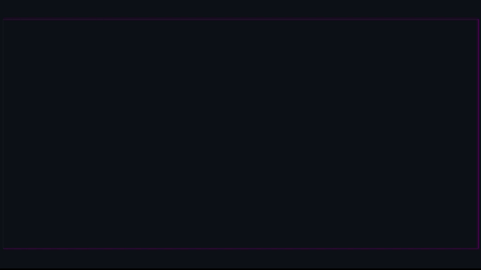

<h1 align="center"> Hi there 👋,I'm Pranjal</h1>

  

<h1>💫About Me :</h1>
<picture> </picture>

        

            <strong>
                Computer Science Engineer, Full Stack Developer, Problem Solver,and Open-Source Enthusiast.  
                I specialize in MERN and  MYSQL Server and I have experience working in React. I I have a great understanding of Algorithms, Data Structures, Database Systems, Object-Oriented Programming, Design Patterns, and Problem Solving skills.  
                I am passionate about learning React, all Back-End Technologies, Web 3, Blockchain, Linux, Virtualization, Cloud Computing, and DevOps.  
                Detailed-oriented, responsible, and committed engineer, with a get-it-done, on-time, and high-quality product spirit. Self and quick learner, self-motivated, and social.
            </strong>
        

        <ul>
            <li>🌱 <b>I’m currently learning</b>: Computer Science and Software Engineering.</li>
            <li>🎯 <b>I’m currently focusing on</b>: <a href="https://leetcode.com/">Problem-Solving</a>, ⭐️ star the projects if you like it 🤩.</li>
            <li>🤔 <b>I’m currently open for</b>: A new job opportunity, <a href="https://flowcv.io/resume/feedback/lMhKFXfgJjf8">LINK TO MY RESUME</a>.</li>
            <li>💬 <b>Ask me about anything</b>: <a href="https://leetcode.com/">Here</a>.</li>
            <li>📫 <b>How to reach me</b>: Catch and follow me from the above links 👆, in addition to follow me here.</li>
            <li>😄 <b>Fun fact</b>: I love Cars(🚗), Coding(💻), and Traveling(🌍).</li>
            <li>👨‍💻 <b>Hire me for Full Stack Development Role</b>: <a href="https://www.upwork.com/freelancers/~0121ca7f3563e57c0b?s=1110580755107926016">Link to my UpWork Full Stack Development Specialization</a>.</li>
        </ul>
    

     

<h1>Tech Stack:👨🏻‍💻</h1>
<!--tech stack icons-->

  

 
<h1> 🏆Github Trophies</h1>

 
 

# 📊GitHub Stats :

 
 

 

<!-- Connect with me -->
<!--h2 without bottom border-->
 
<h1>Connect With Me🤝</h1>
<!--icons and links-->

 

  

<!--
**Pranjalshukla1602/Pranjalshukla1602** is a ✨ _special_ ✨ repository because its `README.md` (this file) appears on your GitHub profile.

Here are some ideas to get you started:

- 🔭 I’m currently working on ...
- 🌱 I’m currently learning ...
- 👯 I’m looking to collaborate on ...
- 🤔 I’m looking for help with ...
- 💬 Ask me about ...
- 📫 How to reach me: ...
- 😄 Pronouns: ...
- ⚡ Fun fact: ...
-->
